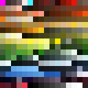
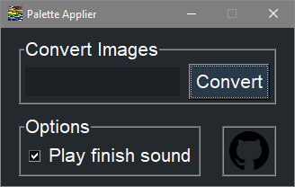
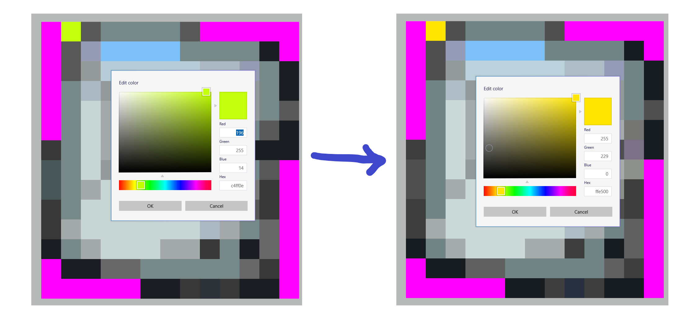

<h1 align="center">Palette Applier</h1>

## Introduction
This program converts images to PNGs that are indexed with a user-provided palette.

## Getting started
Download the [***Palette Applier***](https://www.mediafire.com/file/u97eynahegq437g/Palette+Applier.zip/file) zip, unzip it with a program like [7-Zip](https://www.7-zip.org/) and in the unzipped folder open `Palette Applier.exe`.

Put the images you want to convert into the `Input` folder. Hit the `Convert` button and look in the `Output` folder for the converted images.

If you don't want to use the default Cortex Command palette, replace the `palette.bmp` file in the `Input` folder with your own palette, but make sure to name that new palette file `palette.bmp`.

If you get a "`Microsoft Defender SmartScreen prevented an unrecognized app from starting. Running this app might put your PC at risk.`" popup message when trying to run the program you should press `More info` and then `Run anyway`.

## Getting help
If you need help with anything you can contact the creator of this repository directly by messaging `#MyNameIsTrez1585` on Discord.